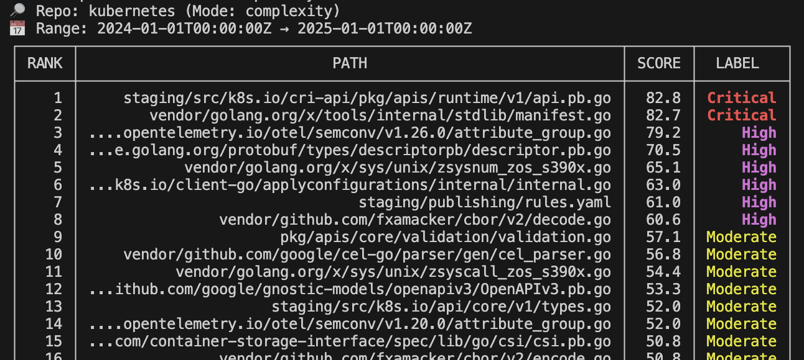

# Hotspot

[](https://github.com/huangsam/hotspot/actions)
[](https://goreportcard.com/report/github.com/huangsam/hotspot)
[](https://github.com/huangsam/hotspot/blob/main/LICENSE)
[](https://github.com/huangsam/hotspot/releases/latest)

Hotspot is a CLI tool that analyzes Git history to diagnose technical debt and bus factor risk based on developer activity, ownership, and churn patterns.


This tool operates as a **data-driven development intelligence.** While traditional [SCA] tools focus on code structure and style, and [DORA] metrics track team performance, Hotspot analyzes **actual development behavior** - commit patterns, ownership distribution, churn trends, and maintenance activity - to diagnose **technical debt** and **bus factor risk** within **your code** at the file and folder level.

[DORA]: https://en.wikipedia.org/wiki/DevOps_Research_and_Assessment
[SCA]: https://en.wikipedia.org/wiki/Static_program_analysis

## Motivation

For years, I've managed projects where everyone *knew* which files were the maintenance nightmares—the ones where a small change led to a two-day debugging session. As engineers, we invest heavily in **Code Correctness** - we run linters, use SCA tools, and write comprehensive unit tests.

However, these traditional QA methods often fail against **System Resilience**. Outages are rarely caused by simple syntax errors; they stem from concurrency issues, unexpected external inputs, or dependency failures - all traced back to code that is too complex, too fragile, or owned by too few people.

Hotspot was born out of the desire to fix that: to provide a transparent, auditable, and quantifiable tool for engineering teams to diagnose the **technical debt** and **knowledge risk** that truly cause production instability.

### Key features

- 🔍 **See what matters** - rank files and folders by activity, complexity, etc.
- ⚡ **Fast results** - analyze thousands of files in seconds
- 🧮 **Rich insights** - contributors, churn, size, age, and risk metrics
- 🎯 **Actionable filters** - narrow down by path, exclude noise, or track trends over time
- 📊 **Export results** - save to CSV/JSON to track trends and progress

### Target audience

- 🧑‍💻 **Developers** tracking sprint or release activity
- 🧹 **Tech leads** prioritizing refactors and risk
- 🧾 **Managers** monitoring bus factor and maintenance debt

## Installation

### Requirements

- **Go 1.25+** for building from source
- **Git 2.2.0+** for `--date=iso-strict` support (used for precise timestamp parsing)

### Install from source

```bash
go install github.com/huangsam/hotspot@latest
```

### Download pre-built binary

Visit the [latest release](https://github.com/huangsam/hotspot/releases/latest) and download the `tar` archive for your system (supports **Windows**, **macOS**, and **Linux**), then extract the binary to your `$PATH`.

## Quick start

```bash
# Analyze files for immediate, tactical risk
hotspot files

# Analyze folders for strategic, subsystem risk
hotspot folders

# For an explicit path
hotspot files /path/to/repo/pkg
```

### Live demo

Here's a demo of Hotspot in action:


### Real world output

Here is what the tool shows for [kubernetes/kubernetes](https://github.com/kubernetes/kubernetes):



This ranking displays the **complexity score** and a colored label based on:

`hotspot files --mode complexity --start 2024-01-01T00:00:00Z --end 2025-01-01T00:00:00Z --workers 16 --follow --exclude 'vendor/,.pb.go'`

## Analysis features

### Scoring modes

The core power of Hotspot lies in its `--mode` flag, which selects the ranking algorithm used to identify different types of risk.

**Example:** Identify owners of high-risk files.

`hotspot files --mode risk --owner`

| Mode | Focus | Description |
|------|-------|-------------|
| **hot** | Activity hotspots | Identify files and subsystems with the most activity. |
| **risk** | Knowledge risk | Find areas with unequal contribution and few owners. |
| **complexity** | Technical debt | Triage files with high churn, large size, and high complexity. |
| **stale** | Maintenance debt | Highlight critical files that are large, old, but rarely touched. |

### Scoring transparency & customization

The `metrics` command displays the formal mathematical formulas for all scoring modes, showing exactly how files are ranked. When using custom weights from a `.hotspot.yaml` config file, it shows your active configuration.

**Example:** View scoring formulas in action.

`hotspot metrics`

### Risk comparison & delta tracking

The `compare` subcommand allows you to measure the change in metrics between two different points in your repository's history. This is the most effective way to audit the impact of a new change set across multiple dimensions.

**Example:** Compare between releases, using the default 6-month lookback.

`hotspot compare files --mode complexity --base-ref v0.15.0 --target-ref v0.16.0`

| Flags | Description |
|-------|-------------|
| `--base-ref` | The BEFORE Git reference (e.g., `main`, `v1.0.0`, a commit hash). |
| `--target-ref` | The AFTER Git reference (defaults to `HEAD`). |
| `--lookback` | Time window (e.g. `6 months`) used for base and target. |

### Timeseries analysis

The `timeseries` subcommand tracks how hotspot scores change over time for a specific file or folder path. This helps you understand trends and identify when risk started increasing or decreasing.

*Note: Timeseries analysis is intentionally more comprehensive and may take longer than other commands, but provides deeper insights into risk evolution over time.*

**Example:** Track complexity score for a specific file over the past 3 months.

`hotspot timeseries --path main.go --mode complexity --interval "30 days" --points 3`

| Flags | Description |
|-------|-------------|
| `--path` | The file or folder path to analyze (required). |
| `--mode` | Scoring mode (hot, risk, complexity, stale). |
| `--interval` | Total time window (e.g., `6 months`, `1 year`). |
| `--points` | Number of data points to generate. |

## Configuration file

For complex or repetitive commands, Hotspot can read all flags from a configuration file named **`.hotspot.yaml`** or **`.hotspot.yml`** placed in your repository root or home directory.

This allows you to manage settings without long command-line strings. Flags always override file settings. We provide three documented examples in the `examples/` directory to cover common use cases:

1.  [hotspot.basic.yml](./examples/hotspot.basic.yml): Quick setup for local development
2.  [hotspot.ci.yml](./examples/hotspot.ci.yml): Optimized settings for automated CI/CD runs (e.g., JSON output)
3.  [hotspot.docs.yml](./examples/hotspot.docs.yml): The canonical template listing every available setting
4.  [hotspot.weights.yml](./examples/hotspot.weights.yml): Advanced customization of scoring algorithm weights

## Common use cases

### Daily & Sprint Workflows

```bash
# 1. Identify active subsystems for daily standup/priority setting
hotspot folders --mode hot --start "2 weeks ago"

# 2. Drill down to the specific active files within a subsystem
hotspot files --mode hot ./path/from/folder/hot --start "2 weeks ago"

# 3. Immediate Refactoring Targets (Files with high recent complexity)
hotspot files --mode complexity --start "3 months ago" ./path/from/file/hot
```

### Strategic Risk & Debt Management

```bash
# 1. Bus Factor/Knowledge Risk Audit (Which subsystems lack owners?)
hotspot folders --mode risk --start "1 year ago"

# 2. Maintenance Debt Audit (Which modules are old, large, and neglected?)
hotspot folders --mode stale --start "5 years ago" --exclude "test/,vendor/"

# 3. Structural Bottleneck Audit (Identify the largest, most-churned, core subsystems)
hotspot folders --mode complexity --start "18 months ago"
```

### Change & Release Auditing

```bash
# 1. Measure Release Risk (Did complexity increase in core folders between releases?)
hotspot compare folders --mode complexity --base-ref v1.0.0 --target-ref HEAD

# 2. Audit File-Level Risk Change (Identify individual files where risk score worsened)
hotspot compare files --mode risk --base-ref main --target-ref feature/new-module

# 3. Track Activity Shift (Which subsystems became 'hot' or 'stale' after the merge?)
hotspot compare folders --mode hot --base-ref v0.15.0 --target-ref v0.16.0
```

### Trend Analysis & Historical Tracking

```bash
# 1. Monitor Critical File Evolution (Track how a core file's complexity changes)
hotspot timeseries --path src/main/java/App.java --mode complexity --interval "1 month" --points 6

# 2. Identify When Risk Started (Find when a file became a maintenance burden)
hotspot timeseries --path lib/legacy.js --mode stale --interval "3 months" --points 8

# 3. Sprint Velocity Impact (See how active development affects file stability)
hotspot timeseries --path pkg/api/v1.go --mode hot --interval "14 days" --points 10
```

## Performance

All measurements use default settings with 14 concurrent workers on a MacBook Pro with M3 chip.

[csv-parser]: https://github.com/vincentlaucsb/csv-parser
[fd]: https://github.com/sharkdp/fd
[git]: https://github.com/git/git
[kubernetes]: https://github.com/kubernetes/kubernetes

### Test Repositories

The benchmarks use repositories of varying scales to demonstrate performance characteristics:

| Repository | Language | Scale | Description |
|------------|----------|-------|-------------|
| [csv-parser] | C++ | Small | Focused single-purpose CSV parsing library |
| [fd] | Rust | Medium | Actively maintained CLI file search utility |
| [git] | C | Large | Complex version control system |
| [kubernetes] | Go | Massive | Distributed container orchestration platform |

### Benchmark Results

Comprehensive performance benchmarks using [this script](./benchmark/main.go), showing averages from 5 runs:

| Repository | Files | Compare Files | Timeseries |
|------------|-------|---------------|------------|
| [csv-parser] | 0.055s | 0.127s | 0.108s |
| [fd] | 0.041s | 0.073s | 0.119s |
| [git] | 0.700s | 1.556s | 2.514s |
| [kubernetes] | 3.745s | 8.832s | 13.411s |
